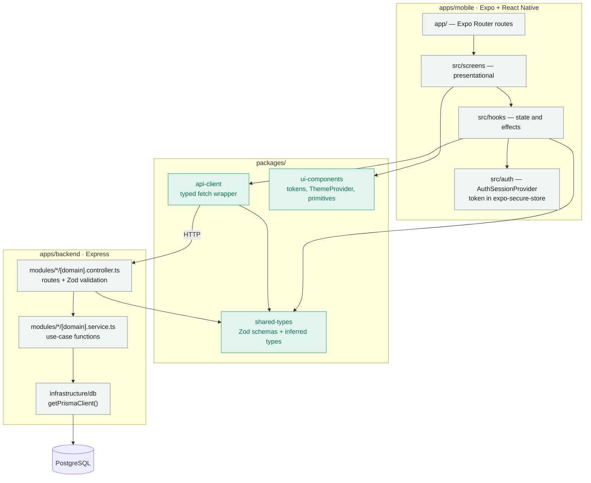
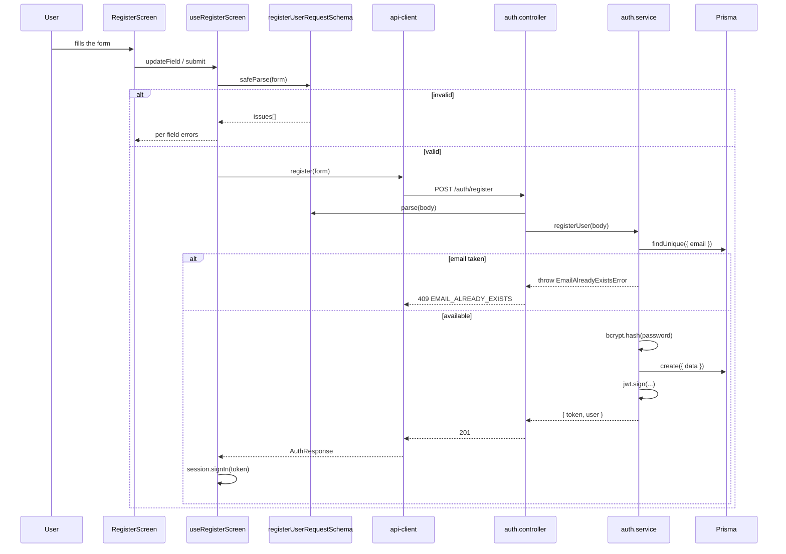
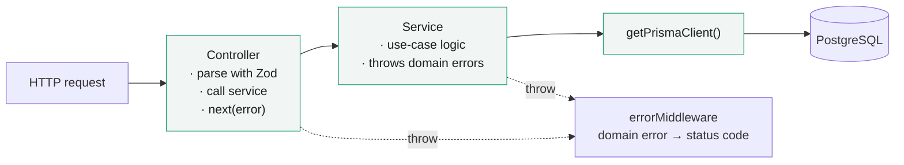
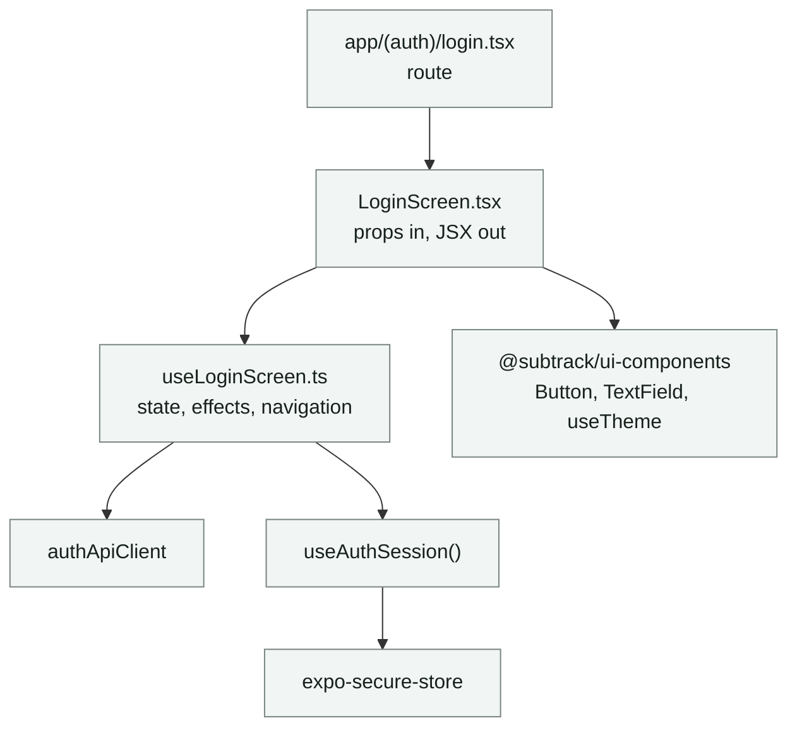

# Subtrack Architecture

How the monorepo is put together, and why it is deliberately small.

---

## 1. The shape of the system

`packages/*` never import from `apps/*`. That is the only hard structural rule.

---

## 2. A request, end to end

The same Zod schema runs on both sides of the wire. The client uses it for
instant per-field feedback; the server uses it because the client cannot be
trusted. One definition, two jobs — this is the abstraction the monorepo
actually exists for.

---

## 3. Backend layering

Two layers, and a rule for when a third is allowed.

**When to add a layer**

| Add                          | Only when                                               |
| ---------------------------- | ------------------------------------------------------- |
| A repository module          | The same query is needed by two or more services         |
| An interface / port          | A second real implementation exists, not a test double   |
| A file per use case          | `[domain].service.ts` passes roughly 200 lines           |
| A new `packages/*` workspace | Both apps import it                                      |

---

## 4. Why this shape

The backend previously used CQRS: every use case was a command type, a handler
class, a repository class, and a port interface, wired by a dependency factory.
For `register` and `login` — five steps each — that was seven files and three
one-implementation interfaces to express about sixty lines of logic.

The layers were removed because none of them were load-bearing:

- **The ports had one implementation each.** `PasswordHasher` was only ever
  bcrypt, `TokenIssuer` only ever jwt, `AuthRepository` only ever Prisma. An
  interface with one implementation is a rename, not an abstraction.
- **They were not buying testability.** That is the usual defense, and the repo
  disproved it: the route tests injected fakes through the ports, but mocking
  the Prisma client module with `vi.mock` gives the same isolation with no
  production indirection at all. The test suite got *larger* after the
  refactor — password-hashing and unknown-email cases were added — while the
  production code shrank.
- **The cost was per-feature.** With eighteen stories queued, every CRUD story
  paid the scaffolding tax before writing a line about subscriptions.

What survived, because it earns its keep:

- **`createApp()` separate from `main.ts`** — the integration tests mount it, so
  it has a real second caller.
- **`shared-types`** — genuinely consumed by both apps, as shown in §2.
- **Domain errors + error middleware** — one place that maps failures to status
  codes, and it keeps controllers free of `if/else` on error type.
- **The lazy Prisma client** — `getPrismaClient()` builds on first use, so
  importing a module that touches the database does not require `DATABASE_URL`
  to be set. The old code achieved this with a dynamic `import()` buried in the
  repository; this states the intent directly.

The rule going forward is in `CLAUDE.md`: **add a layer when a second caller
appears, not before.**

---

## 5. Mobile layering

Screens render; hooks hold state and effects. A "hook" with neither is just a
function returning a constant — inline it into the screen instead.

---

## 6. Known gaps

Tracked on the board, listed here so the diagrams are not read as a claim that
everything is wired:

- **No auth middleware.** Nothing validates the JWT on incoming requests yet;
  every route is public. (`US-AUTH-003`)
- **No token on outgoing requests.** `api-client` sends no `Authorization`
  header and does not handle `401`. (`US-AUTH-003`)
- **No route guard on mobile.** `app/index.tsx` redirects to login
  unconditionally, ignoring an existing session. (`US-AUTH-003`)
- **The Prisma schema and the backlog disagree** on whether a subscription
  belongs to one user or is shared many-to-many, and the model has no `cost`,
  `frequency`, or tags. (`TECH-001`)
