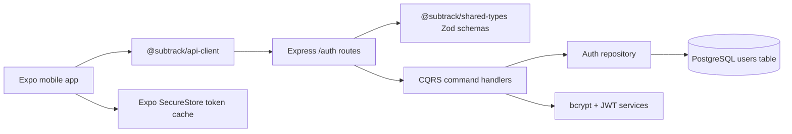
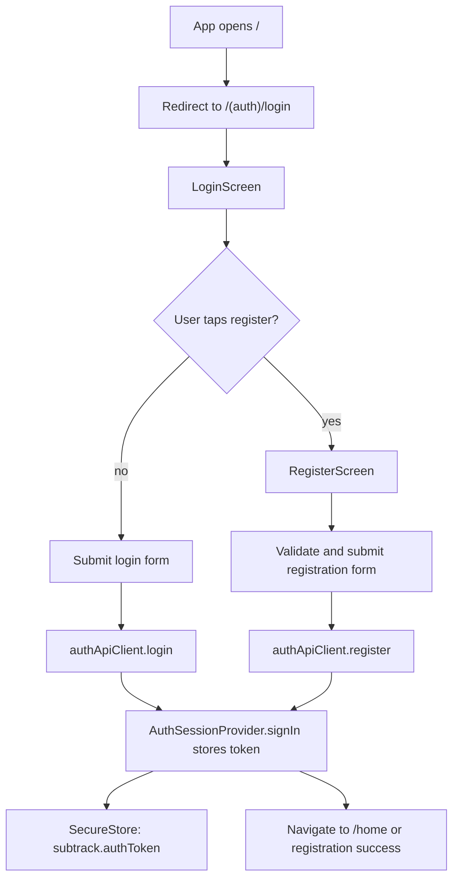
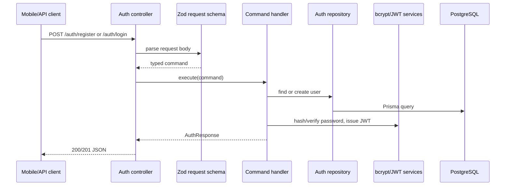
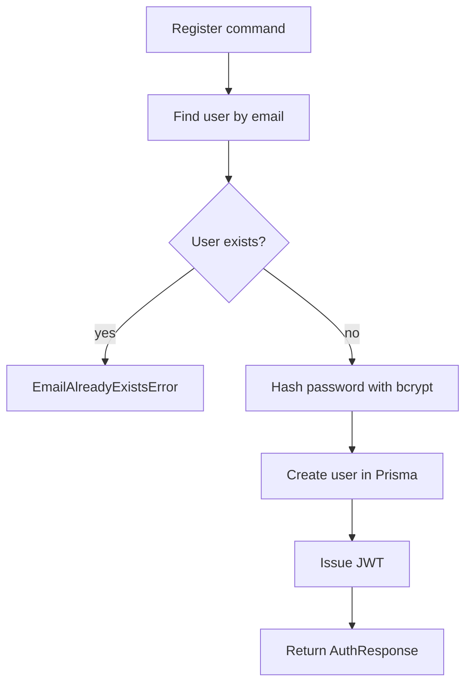
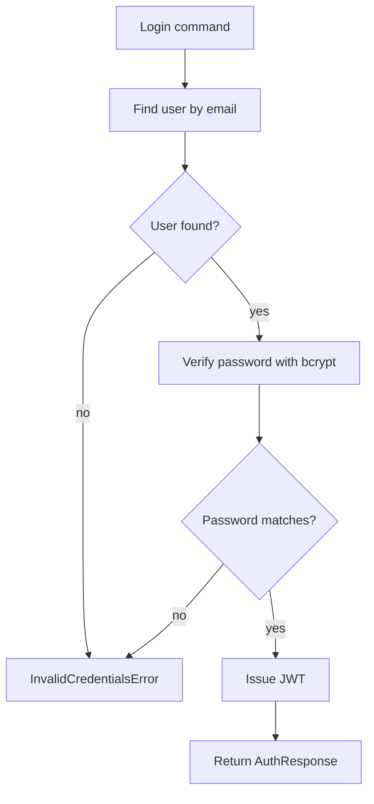
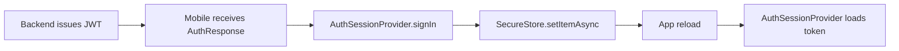

# Authentication Flow

This document explains the current Subtrack authentication flow for new teammates. It covers how registration and login move through the mobile app, shared packages, backend CQRS handlers, and the database.

## Big Picture

Authentication is split across the monorepo so each layer has one clear responsibility:

- `packages/shared-types` defines the request and response contracts with Zod schemas.
- `packages/business-logic` owns pure validation helpers used by the mobile form.
- `packages/api-client` wraps the HTTP calls and validates API responses.
- `apps/mobile` renders auth screens, stores the issued token, and navigates after auth.
- `apps/backend` validates incoming requests, executes CQRS handlers, hashes passwords, issues JWTs, and persists users with Prisma.



## Shared Contract

The auth API contract lives in `packages/shared-types/src/auth.ts`.

Registration accepts:

- `firstName`
- `lastName`
- `email`
- `password`
- `confirmPassword`

Login accepts:

- `email`
- `password`

Both endpoints return the same `AuthResponse`:

```ts
{
  token: string;
  user: {
    id: string;
    email: string;
    firstName: string;
    lastName: string;
  };
}
```

The shared response schema is parsed by `packages/api-client`, so mobile callers only receive data that matches the contract.

## Mobile Flow

Expo Router starts at `apps/mobile/app/index.tsx`, which redirects to `/(auth)/login`. The root layout wraps all routes in `ThemeProvider` and `AuthSessionProvider`.



### Login

`LoginScreen` is presentational. State, submit behavior, and navigation live in `useLoginScreen`.

1. The user enters email and password.
2. `useLoginScreen.submit()` calls `authApiClient.login(form)`.
3. On success, `AuthSessionProvider.signIn(token)` writes the token to `SecureStore`.
4. The app navigates to `/home`.
5. On failure, the screen shows `Invalid email or password`.

### Registration

`RegisterScreen` is also presentational. State, validation, API calls, and navigation live in `useRegisterScreen`.

1. The user enters name, surname, email, password, and confirmation.
2. The hook validates email, password length, and password confirmation with `@subtrack/business-logic`.
3. If validation passes, it calls `authApiClient.register(form)`.
4. On success, the token is stored through `AuthSessionProvider.signIn(token)`.
5. The app navigates to `/(auth)/registration-success` with the user's first name.
6. The success screen can then navigate to `/home`.

## Backend Flow

The backend exposes two auth routes under `/auth`:

- `POST /auth/register`
- `POST /auth/login`

The router lives in `apps/backend/src/modules/auth/auth.controller.ts`. Controllers only validate and orchestrate. Use-case logic stays in command handlers.



### Register Handler

`RegisterUserHandler` performs the registration use case:

1. Checks whether the email is already taken with `repository.findUserByEmail`.
2. Throws `EmailAlreadyExistsError` if the email is unavailable.
3. Hashes the password with `BcryptPasswordHasher`.
4. Creates the user through `PrismaAuthRepository`.
5. Issues a JWT with `JwtTokenIssuer`.
6. Returns the token and public user fields.



### Login Handler

`LoginUserHandler` performs the login use case:

1. Finds the user by email.
2. Throws `InvalidCredentialsError` if no user exists.
3. Verifies the submitted password against the stored hash.
4. Throws `InvalidCredentialsError` if the password does not match.
5. Issues a JWT.
6. Returns the token and public user fields.



## Token Behavior

Tokens are issued by `JwtTokenIssuer`:

- Algorithm defaults to the `jsonwebtoken` library default.
- Subject is the user id.
- Payload includes `email`, `firstName`, and `lastName`.
- Expiration is `1h`.
- Secret comes from `JWT_SECRET`.
- In production, missing `JWT_SECRET` fails backend startup.
- In development, the backend falls back to `development-jwt-secret`.

On mobile, the token is stored in Expo SecureStore under `subtrack.authToken`.



## Error Handling

Errors are normalized by `apps/backend/src/shared/middleware/error.middleware.ts`.

- Zod validation errors return `400` with `VALIDATION_ERROR` and validation issues.
- Domain errors return their own status code, code, and message.
- Unknown errors return `500` with `INTERNAL_SERVER_ERROR`.

The auth domain currently uses:

- `EmailAlreadyExistsError` for duplicate registration emails.
- `InvalidCredentialsError` for missing users or password mismatches.

The mobile API client converts non-OK API responses into `Error` objects using the backend `message` field when available.

## Database Fields

Auth data is stored in the Prisma `User` model:

- `id`
- `firstName`
- `lastName`
- `email`
- `passwordHash`

The database column names are mapped to snake_case where needed, for example `first_name`, `last_name`, and `password_hash`.

## Current Limitations

The current branch implements the first auth slice. A few important pieces are not in place yet:

- There is no backend middleware yet that validates JWTs on protected routes.
- The mobile `/home` route exists, but route guarding based on `AuthSessionProvider.token` is not complete.
- There is no refresh-token flow; JWTs expire after one hour.
- Logout exists in the session provider, but no user-facing logout screen action is currently wired.

